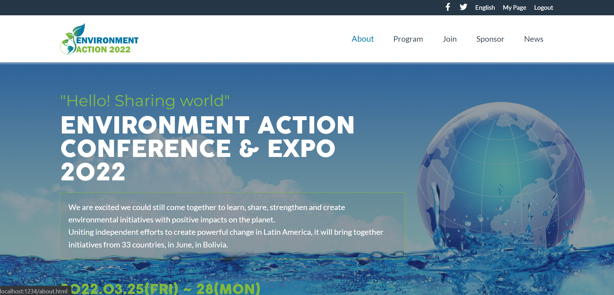

# Environment Action Conference & Expo 2022 Website

> The objective of this capstone project is to build a suitable website to publicize the early arrival of a new edition of the conference and exhibition that Environment Action organizes every two years.

> This conference focuses on keeping active and united the environmental initiatives that independent institutions and individuals in Latin America have been developing, seeking to rebuild the balance of the ecosystem in this part of the planet.

## Features

- The website has two pages working, home and about.
- It displays the content in mobile and desktop viewport.

### Mobile
- It displays less information in some sections like speaker and foother.
- It displays a hamburger menu button. By clicking on the icon it display the menu in a modal window with a smooth effect.

### Desktop
- It displays more information that mobile.
- It displays de menu at the top of the page.
- It display user interactions like hover.

## Built With

- HTML / CSS / Javascript

## Live Demo

[Environmet Action](https://gabyse1.github.io/repo-capston-project-01/)

## Getting Started

To get a local copy up and running follow these simple example steps.

### Prerequisites

- Have a computer

### Install

- Install git on your local computer.
- Clone this repository to your local computer. Choose the location you prefer.

### Deployment

- Execute the index.html file to display the project.

## Authors

👤 **Gabriela Sánchez Espirilla**

- GitHub: [@gabyse1](https://github.com/gabyse1)
- Twitter: [@gabyse0](https://twitter.com/gabyse0)
- LinkedIn: [Gabriela](https://www.linkedin.com/in/gabriela-s%C3%A1nchez-espirilla-83011b225/)

## 🤝 Contributing

Contributions, issues, and feature requests are welcome!

Feel free to check the [issues page](../../issues/).

## Show your support

Give a ⭐️ if you like this project!

## Acknowledgments

- Linters: [Microverse](https://github.com/microverseinc/linters-config)
- Readme template: [Microverse](https://github.com/microverseinc/readme-template)
- Design guidelines: [Behance](https://www.behance.net/gallery/29845175/CC-Global-Summit-2015)
- Some partner logos were copied from actual institutions.

## 📝 License

This project is [MIT](./MIT.md) licensed.
